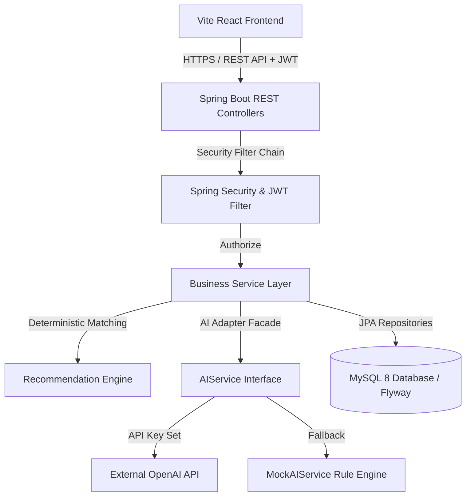

# AlumniConnect — AI-Powered Alumni Networking & Career Guidance Platform


**AlumniConnect** is a college capstone web application connecting students with alumni, providing structured mentorship, enabling alumni to post job openings, facilitating student applications, and offering a **deterministic recommendation engine** alongside an **AI-powered career assistant**.

> **GitHub Repository:** [https://github.com/Thowfika-M/AlumniProject.git](https://github.com/Thowfika-M/AlumniProject.git)

---

## 🚀 Key Features & Capabilities

### 👨‍🎓 Student Portal
- **Profile & Skill Selector:** Manage department, graduation year, bio, resume PDF uploads, and multi-skill tags.
- **Skill Gap Analysis:** Compare acquired skills against industry target role templates (Software Engineer, Data Scientist, Full Stack, DevOps, Product Manager) with calculated match percentages `(matched / total) * 100%`.
- **Transparent Job Recommendations:** View job postings sorted by transparent match accuracy scores with skill badge indicators.
- **Alumni Mentor Matching:** Connect with alumni mentors sharing matching skill sets and departments with human-readable rationale.
- **Applications Tracking:** Submit PDF resumes with duplicate application prevention (`uk_job_student`) and real-time status tracking (`APPLIED`, `UNDER_REVIEW`, `SHORTLISTED`, `REJECTED`, `SELECTED`).
- **Events & Mentorship:** Register for college alumni events and send 1-on-1 mentorship requests.

### 🎓 Alumni Hub
- **Mentorship Management:** Accept or decline 1-on-1 mentorship requests from students.
- **Job Posting & Applicant Review:** Publish job opportunities, specify required skills, set closing dates, download student PDF resumes, and update application statuses.
- **Event Scheduling:** Host tech webinars and college networking sessions.

### 🤖 AI Career Assistant
- **Modular Backend AI Service:** Spring Boot adapter pattern supporting external **OpenAI API** integration (`OpenAIService`) with intelligent **MockAIService fallback** when API keys are unconfigured.
- **Multi-Turn Persistent Chat:** Store conversation history (`ai_conversations`, `ai_messages`) with interactive glassmorphic chat interface, focus mode selector (Career Guidance, Resume Feedback, Interview Prep), and quick prompt chips.

### 🛡️ Admin Moderation Center
- **System Telemetry Dashboard:** Real-time metrics for total users (students vs alumni), active jobs, applications, event participation, and approved mentorships.
- **User Account Moderation:** Searchable user management with role badges, active/disabled status toggling, and account deletion safety controls.
- **Job Removal & Audit Logs:** Remove invalid job postings and audit all administrative actions (`admin_audit_logs`).

---

## 🛠️ Technology Stack

| Layer | Technology |
| :--- | :--- |
| **Frontend** | React 18, Vite, JavaScript (ES6+), React Router DOM v6, Axios, Lucide Icons |
| **Design System** | Glassmorphism Vanilla CSS, Google Outfit & Inter Typography, Custom Tokens |
| **Backend** | Java 17+, Spring Boot 3.2.4, Spring Security 6.x, Spring Data JPA, Hibernate |
| **Security** | JWT (JSON Web Token) Stateless Authentication, BCrypt Password Hashing (10 rounds) |
| **Database** | MySQL 8.0+ (Production/Dev), Flyway Versioned Migrations (`V1` to `V8`), H2 Embedded (Test Suite) |
| **File Storage** | `FileStorageService` (Local disk storage with clean filename handling & PDF extension validation) |
| **AI Integration** | Modular `AIService` facade (`OpenAIService` via `RestTemplate` + `MockAIService` fallback) |
| **Build & Testing** | Maven 3.8+, JUnit 5, Spring Security Test, H2 In-Memory Testing Profile |

---

## 🏗️ System Architecture



---

## 🗄️ Database Schema & Flyway Migrations

The database schema is managed via 8 Flyway SQL migration scripts located in `backend/src/main/resources/db/migration`:

- **`V1__init_schema.sql`**: Core initialization setup.
- **`V2__create_users_table.sql`**: `users` table (`id`, `name`, `email`, `password_hash`, `role`, `phone`, `enabled`, `created_at`, `updated_at`).
- **`V3__create_profiles_and_skills_tables.sql`**: `student_profiles`, `alumni_profiles`, `skills`, `user_skills`.
- **`V4__create_jobs_and_applications_tables.sql`**: `jobs`, `job_skills`, `applications` (with UNIQUE `uk_job_student`).
- **`V5__create_events_mentorship_notifications_tables.sql`**: `events`, `event_participants`, `mentorships`, `notifications`.
- **`V6__create_career_templates_tables.sql`**: `career_templates`, `career_skills` (Target industry roles for skill gap analysis).
- **`V7__create_ai_conversations_tables.sql`**: `ai_conversations`, `ai_messages` (Persistent multi-turn chat history).
- **`V8__create_admin_audit_logs_table.sql`**: `admin_audit_logs` (Admin moderation audit trail).

---

## 📡 REST API Reference Table

### 🔑 Authentication (`/api/auth`)
| Method | Endpoint | Description | Access |
| :--- | :--- | :--- | :--- |
| `POST` | `/api/auth/register` | Register a new Student or Alumni account | Public |
| `POST` | `/api/auth/login` | Authenticate and receive JWT Bearer token | Public |

### 👨‍🎓 Student Profile (`/api/student`)
| Method | Endpoint | Description | Access |
| :--- | :--- | :--- | :--- |
| `GET` | `/api/student/profile` | Get current student profile & skills | Student |
| `PUT` | `/api/student/profile` | Update department, graduation year, bio, resume | Student |
| `POST` | `/api/student/skills` | Update student skill set tags | Student |

### 🎓 Alumni Profile (`/api/alumni`)
| Method | Endpoint | Description | Access |
| :--- | :--- | :--- | :--- |
| `GET` | `/api/alumni/profile` | Get current alumni profile | Alumni |
| `PUT` | `/api/alumni/profile` | Update company, job role, experience, mentorship areas | Alumni |
| `GET` | `/api/alumni/directory` | Search & browse alumni directory | Authenticated |

### 💼 Jobs & Applications (`/api/jobs`, `/api/applications`)
| Method | Endpoint | Description | Access |
| :--- | :--- | :--- | :--- |
| `GET` | `/api/jobs` | Browse active job listings with filters | Public / Auth |
| `POST` | `/api/jobs` | Post new job opening | Alumni |
| `DELETE` | `/api/jobs/{id}` | Delete job posting | Alumni / Admin |
| `POST` | `/api/applications` | Apply for job with PDF resume upload | Student |
| `GET` | `/api/applications/student` | View student's submitted applications | Student |
| `GET` | `/api/applications/job/{jobId}` | View applicants for posted job | Alumni |
| `PUT` | `/api/applications/{id}/status` | Update application status (`ACCEPTED`, etc.) | Alumni |

### 📅 Events, Mentorship & Notifications (`/api/events`, `/api/mentorship`, `/api/notifications`)
| Method | Endpoint | Description | Access |
| :--- | :--- | :--- | :--- |
| `GET` | `/api/events` | List upcoming college events | Authenticated |
| `POST` | `/api/events` | Schedule new alumni event | Alumni / Admin |
| `POST` | `/api/events/{id}/register` | Register for an event | Student |
| `POST` | `/api/mentorship/request` | Send 1-on-1 mentorship request to alumnus | Student |
| `PUT` | `/api/mentorship/{id}/status` | Accept or reject mentorship request | Alumni |
| `GET` | `/api/notifications` | Fetch in-app notifications | Authenticated |

### 🎯 Recommendation Engine (`/api/recommendations`)
| Method | Endpoint | Description | Access |
| :--- | :--- | :--- | :--- |
| `GET` | `/api/recommendations/career-templates` | List target career role templates | Authenticated |
| `GET` | `/api/recommendations/skill-gap` | Execute skill gap analysis against target role | Student |
| `GET` | `/api/recommendations/jobs` | Get job recommendations ranked by match score | Student |
| `GET` | `/api/recommendations/alumni` | Get alumni mentor recommendations with rationale | Student |

### 🤖 AI Features (`/api/ai`)
| Method | Endpoint | Description | Access |
| :--- | :--- | :--- | :--- |
| `POST` | `/api/ai/chat` | Send message in multi-turn conversation | Authenticated |
| `GET` | `/api/ai/conversations` | Get user's past chat history | Authenticated |
| `DELETE` | `/api/ai/conversations/{id}` | Delete past chat stream | Authenticated |
| `POST` | `/api/ai/career-advice` | Generate personalized career roadmap | Student |
| `POST` | `/api/ai/resume-feedback` | Get ATS resume feedback | Authenticated |

### 🛡️ Admin Control Panel (`/api/admin`)
| Method | Endpoint | Description | Access |
| :--- | :--- | :--- | :--- |
| `GET` | `/api/admin/stats` | System telemetry counts | Admin |
| `GET` | `/api/admin/users` | List all registered users | Admin |
| `PUT` | `/api/admin/users/{id}/toggle-status` | Enable/Disable user account | Admin |
| `DELETE` | `/api/admin/users/{id}` | Delete user account | Admin |
| `GET` | `/api/admin/jobs` | Moderation list of all jobs | Admin |
| `DELETE` | `/api/admin/jobs/{id}` | Remove job listing | Admin |
| `GET` | `/api/admin/audit-logs` | Retrieve admin audit log history | Admin |

---

## ⚡ Local Installation & Setup Guide

### 1. Prerequisites
- **JDK 17 or higher**
- **Node.js 18+ & npm**
- **MySQL 8.0+**
- **Maven 3.8+**

### 2. Database Setup
Create MySQL Database:
```sql
CREATE DATABASE alumnidb CHARACTER SET utf8mb4 COLLATE utf8mb4_unicode_ci;
```

### 3. Backend Setup & Run
Navigate to `backend/` directory:
```bash
cd backend
```

Configure `src/main/resources/application.properties` (or pass via environment variables):
```properties
spring.datasource.url=jdbc:mysql://localhost:3306/alumnidb?createDatabaseIfNotExist=true&useSSL=false&allowPublicKeyRetrieval=true&serverTimezone=UTC
spring.datasource.username=root
spring.datasource.password=root

jwt.secret=9a4f2c8d7e1b3a6c5e8f0d2b4a6c9e1f3a5b7c8d0e2f4a6b8c0d2e4f6a8b0c2d
```

Compile and run Spring Boot backend:
```bash
mvn clean spring-boot:run
```
*Backend runs on `http://localhost:8080` and automatically applies Flyway migrations (`V1` to `V8`).*

### 4. Frontend Setup & Run
Navigate to `frontend/` directory in a new terminal:
```bash
cd frontend
npm install
npm run dev
```
*Frontend runs on `http://localhost:5173`.*

### 5. Automated Unit & Integration Testing
To run the Spring Boot automated test suite using the embedded H2 profile:
```bash
cd backend
mvn test
```

---

## 📜 License & Capstone Project Credits

Designed and developed for the **College Senior Capstone Project**:

- **Repository:** [https://github.com/Thowfika-M/AlumniProject.git](https://github.com/Thowfika-M/AlumniProject.git)
- **Author:** Thowfika M
- **License:** MIT License
